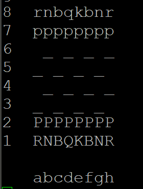
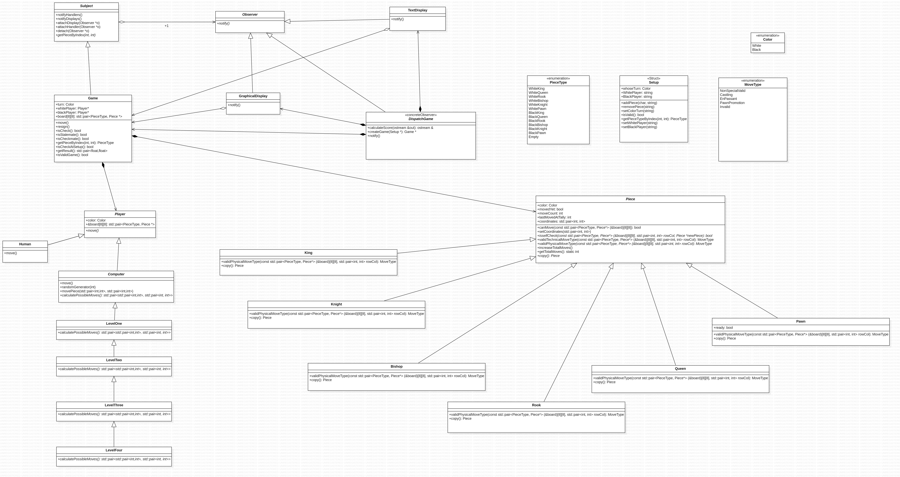

# Chess-Plus-Plus
This is a placeholder repository. The code cannot be made publicly available due to academic policies. If you would like access/view to the code, please contact me directly.

git # Chess++

### Introduction 
chess, one of the oldest and most popular board games, played by two opponents on a checkered board with specially designed pieces of contrasting colours, commonly white and black. White moves first, after which the players alternate turns in accordance with fixed rules, each player attempting to force the opponent’s principal piece, the King, into checkmate—a position where it is unable to avoid capture. In this version of the game, we are implementing two Players (Human and Computer (Level 1,2,3,4)).

## Chess Features
As per the documentation provided, we should have atleast implemented the following features:-

Chess is played on an 8x8 checkerboard, arranged so that there is a white square at the bottom right. Players take turns making one move at a time. The player controlling the white pieces makes the first move.
There are six types of pieces:

• **King (K)** Moves one square in any direction.

• **Queen (Q)** Moves in any of the eight possible directions, any distance, but cannot move past any piece that blocks its
path.

• **Bishop (B)** Moves in any of the four diagonal directions, any distance, but cannot move past any piece that blocks its
path.

• **Rook (R)** Moves in any of the four vertical/horizontal directions, any distance, but cannot move past any piece that
blocks its path.

• **Knight (N)** If it sits on square (x, y), it can move to square (x ± 2, y ± 1) or (x ± 1, y ± 2). Can “jump over” any piece
that blocks its path.

• **Pawn (P)** Moves one square forward.

A piece captures another piece by moving onto the square occupied by that piece. The captured piece is then permanently removed from the board. A piece that could capture another piece is said to attack that piece. A piece may only capture a piece of the opposite colour.

The object of the game is to place your opponent’s king under attack, such that your opponent’s king cannot escape in one move. This is known as checkmate. An attack on the king, whether it can escape or not, is known as check.

The following additional rules govern the movement of pieces:
• The pawn is the only piece whose standard move is different from its capturing move. A pawn moves only forward, but it captures on the forward diagonals (one square). Thus, on capturing, a pawn must move diagonally forward, one square, to take over a square occupied by another piece.

• A pawn, on its first move, may move either one square forward or two squares forward.

• If a pawn, by moving two squares forward, avoids capture by another pawn (i.e, if moving one square forward would  have put it under attack by another pawn), the would-be attacking pawn may still capture it by moving one square diagonally forward to the square the other pawn skipped over. This is known as pawn capture en passant. This option is only available immediately following the two-square move by the opposing pawn. If you wait, you can’t do it.

• A pawn, upon reaching the other end of the board is replaced by either a rook, knight, bishop, or queen (your choice).

• A move known as castling helps to move the king to a safer square while simultaneously mobilizing a rook. To execute it, the king moves two squares towards one of the rooks, and that rook then occupies the square “skipped over” by the king. This happens in one move. For castling to be legal, the king and rook used must not previously have moved in the
game; there must be no pieces between the king and rook used; and the king must not be in check on either its starting position, its final position, or the position in between (to be occupied by the rook).

• It is not legal to make any move that puts your king in check.

• If any player ever has no legal moves available, but is not in check, it is known as stalemate, and the game is a draw.

# Overview (Basic Implementation)
As our UML suggests, we’ve got a Game class that pertains most important functions of the chess board and its interaction with our observers and subjects. Our Chess board is a 2D Array of of **PieceType** and **Piece***. The observers for each subject are set using the attachHandler() and attachDisplay(). In terms of board construction, our program uses createGame(Setup *) to construct a new Game. Afterwards, Game() constructor places the default setting of the chess pieces in their respective positions. The Game class has various boolean functions to specify the current state of conditions such as check, checkmate, castle, stalemate etc.  (Update this too)

The Setup class is class responsible for handling the setup mode as well as the default Game setup of chess.It allows the player to place any piece at any position of the board which helps to check for various moves and practice diffferent scenarios of chess. Our main function will be responsible for creating and deleting an object of this class. 

Our Abstract Player class is responsible for containing the virtual function move() which is overriden depending on the type of Player(Human or Computer). We are also defining our Chess board in the player class. Our Player class has two derived class Human and Abstract Computer class which is further inhertied by different levels of Computer (Level 1, Level 2, Level 3, Level 4). Both Human and Computer class contains the function move() which checks for Castling , EnPassant, Pawn promotion and a valid move and makes the move on the board respectively. 

The other class that is of major significance is the Piece class. The Piece class has six children class(i.e the 6 pieces in chess):
King, Queen, Rook, knight, Bishop and Pawn.The Piece class outlines all the functions carried out by all various pieces on the board. The important methods defined in the piece class is canMove which takes in our board as parameter and checks if the move is possible or not, isSelfCheck() is responsible for checking if the king is not getting check if we make the given move.

Finally, we have the TextDisplay and GraphicsDisplay to draw the board and the dynamic pieces on its static cells. Both of those displays are mostly dependent on the notify() that lets them know which piece has changed and allows to display accordingly.

Flow of our Code:

Flow of our Program:

# Updated UML 

# Design Pattern
We owe a big thank you to all the professors and support staff for making such a wonderful assignment on design patterns, Because it really helped us get an intuitive understanding of the Observer Design Pattern and MVC architecture.

We are adopting MVC architecture with observer pattern handling our views (i.e TextDisplay and GraphicalDisplay)
Observer pattern is quite useful in the game of Chess due to mainly two reasons:

1. Less coupling between objects that interact with each other.
With the implementation of notifying the observer function, and the interface of receiving
notification from the subject using template, each cells, text display, and graphics display
possess their own method of receiving and updating their states. With unified way of
notifying the observers for the subjects, there is not much coupling between objects.
2. Simple object attach / remove process
The association between observer and subject can be easily added or removed using
unified attach function for the subject. Via unification method of attaching observers to
each subject, the relationship between objects does not have to individually handled in
the game flow implementation.

**Implementation of Observer Pattern within our Game**\
•	Observer (DispatchGame (Handler class of Game)): It is responsible for initializing and deleting the Game class, TextDisplay, GraphicalDisplay class as well as keeping a tally of the total score. 

•	Game Class (Subject): This class is responsible for initializing and deleting all the game pieces and players. It also maintains the single source of truth for the entire layout of the game board. At every change of this Game board (i.e for every move) the Game class calls notifyDisplay() to update the state and render the new Graphical and Text board. Also, after every move the Game checks for `Check` which determines if the other player have been checked after the current move, it further checks for `Checkmate` and `Stalemate`. After the end of current Game class calls notifyHandlers() to update the current tally in the Handler classes. 

•	TextDisplay: In order to test the correct implementation of the code, we are creating a TextDisplay class which is rendered after every state change. 

•	GraphicalDisplay:  After every move by the player, the GraphicalDisplay is notified and re-renders the board again.

**Implementation of controller methods of Game class**\
•	Move: calls player class which parse and evaluates the move according to the player type (Human or Computer) which then calls the observer pattern to re-render the board.

•	Resign: When the resign function is called it deletes the current Game which further calls notifyHandlers() to update the current tally in the Handler class. As well as destroying all its players and pieces.

**Implementation of Model in MVC**\
Most of the logic resides in the Player and the subsequent piece classes
•	Player class: It processes the move provided to the abstract player class via the controller Game class. If the player is human, the move is subsequently sent to the piece class, to check its validity, whereas the computer class creates the move in accordance with the logic in piece class. Our choice to create the computer class separate from the rest of logic helps us to implement and expand our code further without much changes in the underlying design.

•	Computer Class: Our team deployed 4 levels of Computer players. These players are not perfect like the online chess AI but they implement the required strategy of moves in accordance with the assignment guidelines.
The four levels are carried out as follows:

**Level 1:**
This level aims to make random but valid moves for the pieces. Our team has first defined a
vector to save location to the different Pieces on the board. Then a piece is randomly chosen
from the vector by generating a random number using rand() from standard C++ <cstdlib>
library; specifically, the random number does not exceed the number of total locations present in
the vector. The program once again tries to obtain random coordinates for the chosen piece to
move to. If the specific piece has a valid move to the chosen position, then the move is carried
out. The program checks the validity of the move using canmove() method.

**Level 2:**
At level 2, the program prioritizes capturing and checking the opponent’s pieces, then capturing the opponent piece , followed by checking the opponents piece over randomness. Initially, the program uses three vectors: checkingMoves vector, capturingMoves vector and checkingAndCapturingMoves vector and they all store pair of location of the moves. If all the moves from the above vector has failed or the there is no move in the vectors, it makes a random move using Level 1.

**Level 3:**
Level 3 follows instructions such that avoiding capture is the first preference. There are 4 vectors stroing information of the state of all the Pieces on which one’s pieces are on are not in danger, then the program follows the
preferences (avoidCapture And Capturing And CheckingMoves >> avoidCapture And CapturingMoves >> avoidCaptureMoves) following the preference of moves in level 2.

**Level 4:**
The last level’s behaviour is similar to that of level 2. However, the key difference is that it only
tries to capture the opponent’s piece if that capture move does not put one’s piece in danger after
it’s carried out. As a result, this level tries to carry out a more cautious approach. Hence, the next
preference is to avoid getting captured if it is possible. Thus if a piece cannot capture while
ensuring it’s safety, then level move prefernce is called.

•	Abstract Piece class on the other hand, is responsible for checking and validating the moves on the board. As well as determining the possibility of any legal move by the piece. 

## Resilience to Change (describe how your design supports the possiblity of various changes to the program specification)

It was our utmost priority to make our code extendible and resilience to change. This was the reason why we had implemented the **Observer Pattern**. 

(Add +++ in this)
---
# Answers to Questions (the ones in your project specification)

**Question**: Chess programs usually come with a book of standard opening move sequences, which list accepted opening moves and responses to opponents’ moves, for the first dozen or so moves of the game. Although you are not required to support this, discuss how you would implement a book of standard openings if required?

**Answer to Question 1:**\
 This will be implemented only in computer class, as only computer can move according to some standard openings and moves. We will then create a vector in computer class that stores the configuration of opponent’s piece, and our wanted piece to be moved (assuming our piece has not moved even once). Then at every move call to applicable computer, we will parse through current state of board, and once any value in vector matches the current configuration of our board, we will move according to that value.
 
**Question**: How would you implement a feature that would allow a player to undo their last move? What about an unlimited
number of undos?

**Answer to Question 2:** \
To build a feature that would allow a player to undo their infinite moves, we can create a vector (let’s say vecA) in game that will store all the moves that have happened in the game at present, along with pointer of piece that was eliminated, if any. Rather than deleting the necessary piece, we will store its pointer in another vector (let’s say vecB) and keep its vector index stored vecA (corresponding to the move that deleted the piece).  So, whenever an undo is called, we can just go the end of vecA and use a method to modify the necessary changes on current board.
 
**Question**: Variations on chess abound. For example, four-handed chess is a variant that is played by four players (search for it!). Outline the changes that would be necessary to make your program into a four-handed chess game.

**Answer to Question 3:** \
 \
Firstly, we will modify the view classes (TextDisplay and GraphicDisplay) to render 14\*14 chess square board along with necessary color changes. Additionally, number of players will increase from 2 to 4, additional player colors will be added, and one player will now be battling against the other three. The dimension of our new board in Game class will be an implementation of a 14\*14 array, in which the corner 3*3 squares will be considered invalid. If a player is checked, instead of deleting its pieces from the board, we will keep its pieces on the board blocking up the squares on which they stand. All the logic in pieces and computer will be changed to accommodate 4 players. Also, we must implement a feature where a checkmated player also re-gains the right to move if his opponents themselves raises the checkmate.

---
## Extra Credit Features (what you did, why they were challenging, how you solved them—if necessary
---

## Final Questions (the last two questions in this document).

**Question 1:** What lessons did this project teach you about developing software in teams? If you worked
alone, what lessons did you learn about writing large programs?

**Answer:** 
Most importantly, we learnt that developing software in teams requires cooperation,
communication, and effective collaboration. It was not always easy to follow the train of thought
of the other team members, but once we got used to it and spent time on understanding what the
other person wants to do, we found that the implementation became way easier. Furthermore,
this process helped us in terms of eradicating errors or missed cases from earlier times. As
everyone has different schedules, we had to make sure we were communicating regularly and
letting each other know about the progress. To prevent any contradictory code, we tried to make
sure to work at different files. However, it was difficult to maintain that sort of separation all the
time. Ultimately, git allowed us to share our changes once everyone was done with their work
and in turn take care of merge errors if there were any

**Question 2:** What would you have done differently if you had the chance to start over?

**Answer:** If we were to start over, we would include had a more rigorous timeline, using unit testing from the 
beginning and started with the game including functions that would allow the game to change its 
state. This would allow us to create more deliverable and deadline accountability, compile and test 
each class earlier – improving the likelihood they all work together by the deadline, and implement 
en passant, castling etc. and build a computer player with significantly more ease. This would save countless 
hours, reduce the amount of communication between the partners in the group and reduce stress 
and sleep deprivation

